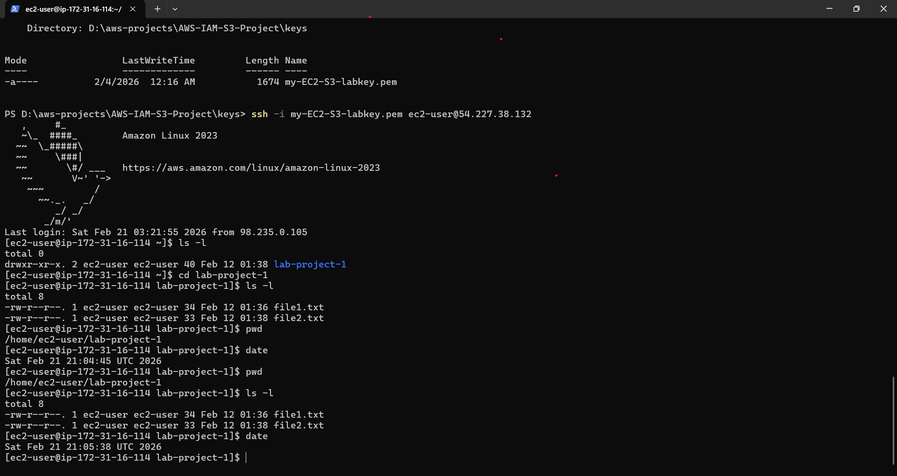

###Hands-on AWS Project | EC2 to S3 Secure Automation using IAM Role (No hardcoded credentials)
# Automated Secure File Upload from EC2 to S3 storage using IAM Role and Cron Automation

##  Project Overview
This project demonstrates how to securely automate file uploads from an Amazon EC2 instance to an Amazon S3 bucket using an IAM Role and Cron Scheduling
Instead of using hardcoded AWS credentials, the EC2 instance assumes an IAM Role that grants temporary permissions to interact with S3
Automation is implemented using a bash script combined with Cron Scheduling to simulate automated backups or log uploads

## Architecture
USer➡️SSH Connection ➡️EC2 Instance ➡️IAM Role (Temporary Credentials) ➡️S3 Bucket
## Services Used
Amazon EC2 
Amazon S3
IAM Roles
AWS CLI
Linux Cron Scheduler

## Secure Access Implementation
Created a private S3 bucket (my-aws-lab-bucket-JohnK)
Attached an IAM Role to the EC2 instance
Granted least-Priviledge permission: 's3:PutObject'

## Verified Iam Role Credential
To Confirm that the EC2 instance successfully assumed the IAM Role the Instance Metadata Service was queried using:
'''bash
curl http://169.254.169.254/latest/meta-data/iam/security-credentials/
'''
## Successfully uploaded files using:
'''bash
aws s3 cp file1.txt s3://my-aws-lab-bucket-johnk/
'''
## Automation Implementation
Created a bash script that generates dynamic files and uploads them automatically:
'''bash
#!/bin/bash

DATE=$(date +%F-%H-%M-%S)
FILE="backup-$DATE".txt"

echo "Backup created at $Date" > $FILE

aws s3 cp $FILE s3://my-aws-lab-bucket-johnk/
'''
Made Script Executable:
'''bash
chmod +x upload.sh
'''
Automate With Cron:
'''bash
crontab -e
'''
Added:
'''bash
*/5**** /home/ec2-user/upload.sh
'''
## Challenges And Troubleshooting
Resolved "Access Denied" errors by adjusting IAM policy
Fixed permission issued related to bucket ARN
Debugged AWS CLI command formatting

## Key Lessons Learned
IAM Roles are more secure than hardcoding credentials
Automation reduces manual workload
Cron enables scheduled cloud tasks
Proper troubleshooting improves cloud operational skills

## Screenshots

### EC2 Instance Running
Shows the EC2 instance successfully launched and accessible.

### Local Files on EC2
Shows files created on the EC2 instance before upload

### Automation Proof (S3 Upload)
Shows files successfully upload to S3 using automation

## How to Reproduce This Project
1. Launch an EC2 instance (Amazon Linux 2023)
2. Create an IAM Role with S3 access permissions
3. Attach the IAM Role to the EC2 Instance
4. Connect to EC2 using SSH
5. Create test files in the EC2 Instance
6. Use AWS CLI to upload files to S3
7. Create a bash script to automate uploads
8. Schedule the script using cron
9. Verify files are uploaded to S3
    

